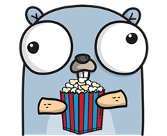
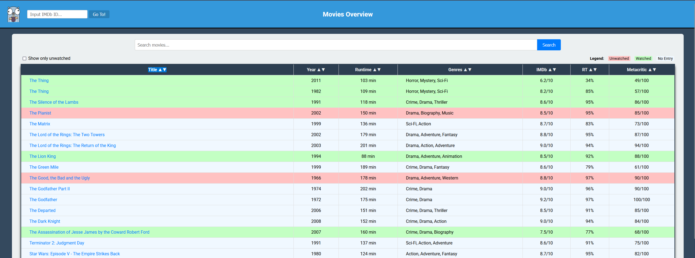
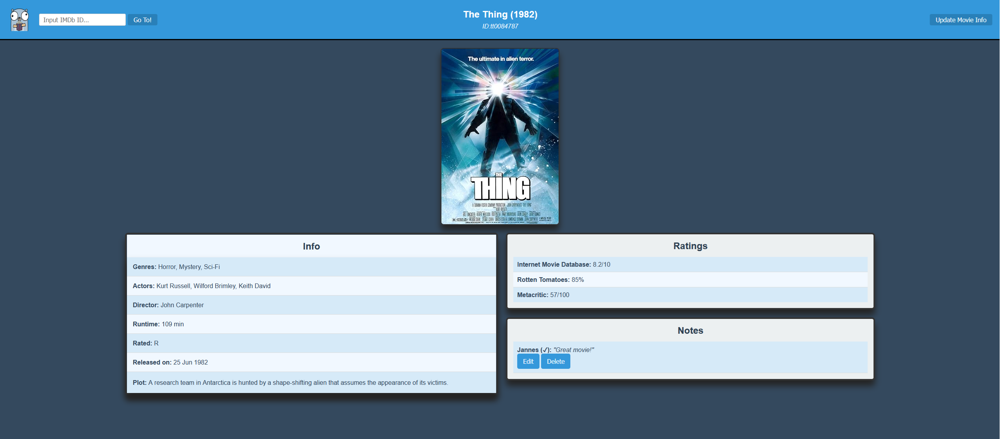

# GoMovie


## About
GoMovie is a simple web app to keep track of your favorite movies, you already watched or still want to watch. Its goal is to help manage a watchlist directly in the browser.
Data for every movie is pulled from [OMDB](https://www.omdbapi.com/), so to use this yourself you will need an API key for the site.
Information presented includes Title, Year, Genres, Actors, Directors, and Ratings from various sources, if available.
The app stores details such as who recommended the movie, whether it has been watched, and personal comments about the movie in a SQLite database.

### Example Overview

### Example Info Page



### To build yourself you'll need:
  - Go (developed with 1.23)
    -  [go-task](https://taskfile.dev/) if you want to use Taskfile to build
  - [OMDB](https://www.omdbapi.com/) API key

### Environment Variables
 this app expects the following env variables to be set:
 - OMDB_KEY
    - API key for OMDb
 - gomovie_JWT
    - secret key for JSON Web Token

either set them in your os, pass them when running the server, or use a .env file like this:
```shell
# Environment Variables for App
OMDB_KEY=<verysecretkey>
gomovie_JWT=<somekey>
```

### TODO:
  - ~~Index Page~~
  - ~~Search Bar~~
    - search for genres, year, already watched etc.
    - kinda done, but needs additional work
  - ~~Delete Entries~~
  - ~~Split Genres and Actors~~
    - ~~separate db tables for them~~
  - ~~Update Button for new movie info (poster, ratings)~~
    - ~~especially recently announced movies have a placeholder image as poster and obviously no ratings, updating them should provide the ratings and poster at the time of updating~~
  - ~~Color Grading of rows, to show if they are watched~~
  - ~~checkbox to toggle showing only unwatched movies on overview~~
  - ~~redirecting to overview when accessing login page with valid cookie~~
  - use transactions for DB interactions
  - more than one list per user, ability to invite users to a list
  - display statistics
    - watched/unwatched ratio, how many movies of X genre, which actors are featured often etc.

### Routes:
- GET /health : returns healthy if server is running
- GET / : redirects to login page
- GET /login : displays login page
- POST /login : checks credentials provided by form values of username and password
- GET /register : open register page
- POST /register : creates new user account
- GET /overview : displays overview page of all movies in database
- GET /search : searches for movie by imdb id
- GET /films/{imdb} : returns info page for movie with imdb id
- PUT /films/{imdb} : updates movie info with newly fetched api data
- POST /films/{imdb}/entry : posts a new entry for movie
- PUT /films/{imdb}/entry : changes the entry saved for that movie
- DELETE /films/{imdb}/entry : deletes entry belonging to movie (does not delete movie from db, maybe later)

## Setup
Use either:
- Taskfile
  - you will need [go-task](https://taskfile.dev/) for this
  ```shell
    # be sure to provide an OMDb API key and a JWT secret
    # either as environment variable or via .env file
    # cd into project root
    cd gomovie
    # run task with default build target (no args) to setup, test and build the application
    task
    # you can also run every task independently (test, clean, ...)
    # - task test
    # - task clean
    # execute file
    ./bin/gomovie_svr
  ```

- Docker
  ```shell
    # Run Docker client
    # cd into project root
    cd gomovie
    # build docker image e.g.
    docker build --tag docker-gomovie .
    # spin up the container
    # remember to pass your omdb api key and a JWT secret as a env variable
    docker run -d --publish 8080:8080 -e OMDB_KEY=your_key -e gomovie_JWT=jwt_secret docker-gomovie
  ```

- or the classic way
  ```shell
    # compile
    go build cmd/gomovie/gomovie.go
    # run
    ./main
  ```
